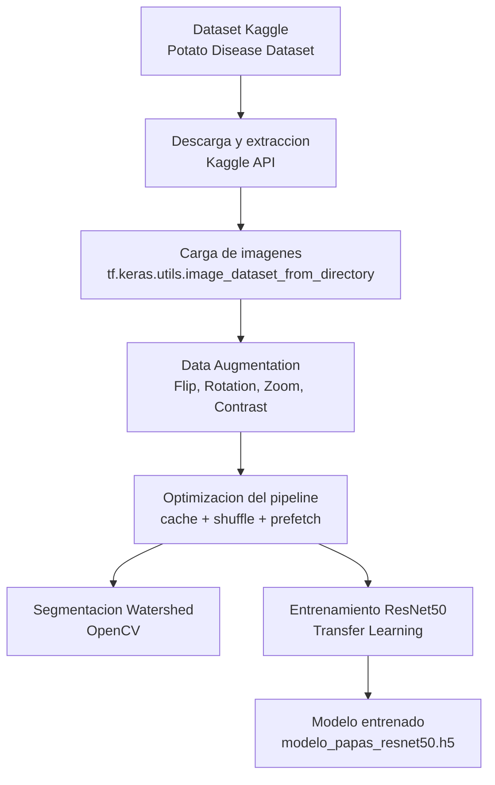
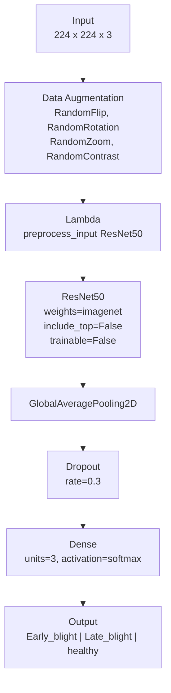
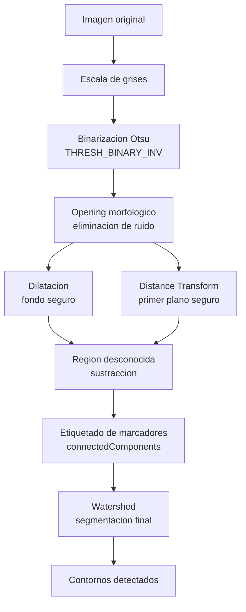
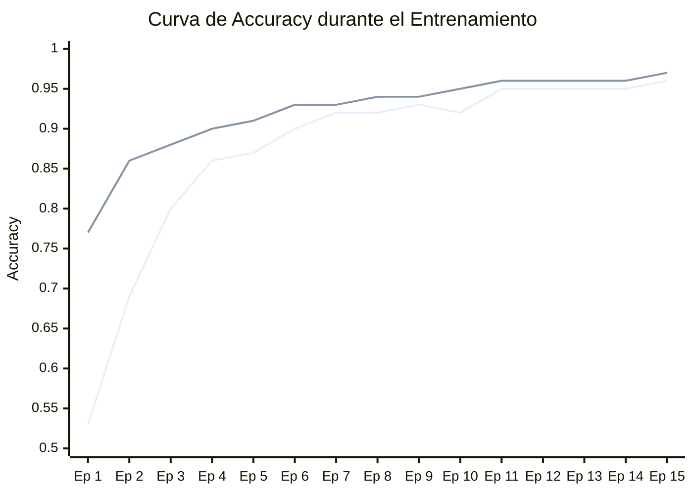

# Clasificacion de Enfermedades en Hojas de Papa

Sistema de clasificacion automatica de enfermedades en hojas de papa mediante redes neuronales convolucionales (CNN) con Transfer Learning utilizando **ResNet50** y segmentacion de imagenes con el algoritmo **Watershed** (OpenCV).

El modelo distingue entre tres estados de la planta:

| Clase | Descripcion |
|-------|-------------|
| `Potato___Early_blight` | Tizon temprano |
| `Potato___Late_blight` | Tizon tardio |
| `Potato___healthy` | Hoja saludable |

---

## Arquitectura General



---

## Arquitectura del Modelo



**Configuracion de entrenamiento:**

| Parametro | Valor |
|-----------|-------|
| Optimizador | Adam (lr=0.0001) |
| Funcion de perdida | sparse_categorical_crossentropy |
| Early Stopping | patience=3, monitor=val_loss |
| Epocas maximas | 15 |
| Batch Size | 32 |

---

## Segmentacion Watershed



El modulo `Segmentacion.py` implementa el algoritmo Watershed de OpenCV para aislar la hoja del fondo, utilizando binarizacion de Otsu, operaciones morfologicas y transformada de distancia.

---

## Dataset

**Fuente:** [Potato Disease Dataset - Kaggle](https://www.kaggle.com/datasets/faysalmiah1721758/potato-dataset)
**Licencia:** CC0 1.0 (Dominio Publico)

| Clase | Imagenes |
|-------|----------|
| Potato___Early_blight | 1,000 |
| Potato___Late_blight | 1,000 |
| Potato___healthy | 152 |
| **Total** | **2,152** |

**Distribucion del pipeline:**

| Conjunto | Imagenes | Porcentaje |
|----------|----------|------------|
| Entrenamiento | 1,722 | 80% |
| Validacion | 430 | 20% |

---

## Estructura del Proyecto

```
PAPA-PROYECTO/
├── Dataset.ipynb                    # Notebook principal: descarga, preprocesamiento,
│                                    # segmentacion, entrenamiento y visualizacion
├── Entrenamiento.py                 # Script standalone del entrenamiento con ResNet50
├── Segmentacion.py                  # Script standalone de segmentacion Watershed
├── modelo_papas_resnet50.h5         # Modelo entrenado (pesos y arquitectura)
├── potato-dataset-metadata.json     # Metadata del dataset (formato Croissant/MLCommons)
└── .gitignore
```

---

## Tecnologias

| Libreria | Uso |
|----------|-----|
| TensorFlow / Keras | Framework de Deep Learning, construccion y entrenamiento del modelo |
| ResNet50 (ImageNet) | Arquitectura base preentrenada (Transfer Learning) |
| OpenCV | Segmentacion de imagenes con algoritmo Watershed |
| NumPy | Operaciones numericas y manipulacion de arrays |
| Matplotlib | Visualizacion de resultados y Data Augmentation |
| Kaggle API | Descarga automatizada del dataset |
| Jupyter Notebook | Entorno de desarrollo interactivo |

---

## Requisitos

- Python 3.13+
- TensorFlow
- OpenCV (`opencv-python`)
- NumPy
- Matplotlib
- Kaggle API

```bash
pip install tensorflow opencv-python numpy matplotlib kaggle
```

Para la descarga del dataset se requiere el archivo `kaggle.json` con las credenciales de la API de Kaggle en el directorio de trabajo.

---

## Uso

### Notebook principal (recomendado)

El archivo `Dataset.ipynb` contiene el flujo completo: descarga del dataset, preprocesamiento, Data Augmentation, segmentacion Watershed, entrenamiento y guardado del modelo.

```bash
jupyter notebook Dataset.ipynb
```

### Entrenamiento standalone

```bash
python Entrenamiento.py
```

Requiere que `train_dataset`, `validation_dataset`, `class_names` y `data_augmentation` esten definidos previamente en el entorno.

### Segmentacion standalone

```bash
python Segmentacion.py
```

Requiere una imagen de prueba `papa_prueba.jpg` en el directorio de trabajo. La ruta puede modificarse en la funcion `aplicar_watershed()`.

---

## Resultados del Entrenamiento

| Epoca | Accuracy | Loss | Val Accuracy | Val Loss |
|-------|----------|------|--------------|----------|
| 1 | 0.5319 | 0.9528 | 0.7651 | 0.6293 |
| 5 | 0.8682 | 0.3537 | 0.9116 | 0.2580 |
| 10 | 0.9245 | 0.2058 | 0.9512 | 0.1660 |
| 15 | 0.9570 | 0.1436 | 0.9651 | 0.1285 |

**Mejor resultado:** Val Accuracy = **96.51%** | Val Loss = **0.1285**



---

## Licencia

Este proyecto utiliza el **Potato Disease Dataset** disponible en Kaggle bajo licencia **CC0 1.0 (Dominio Publico)**.
